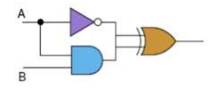
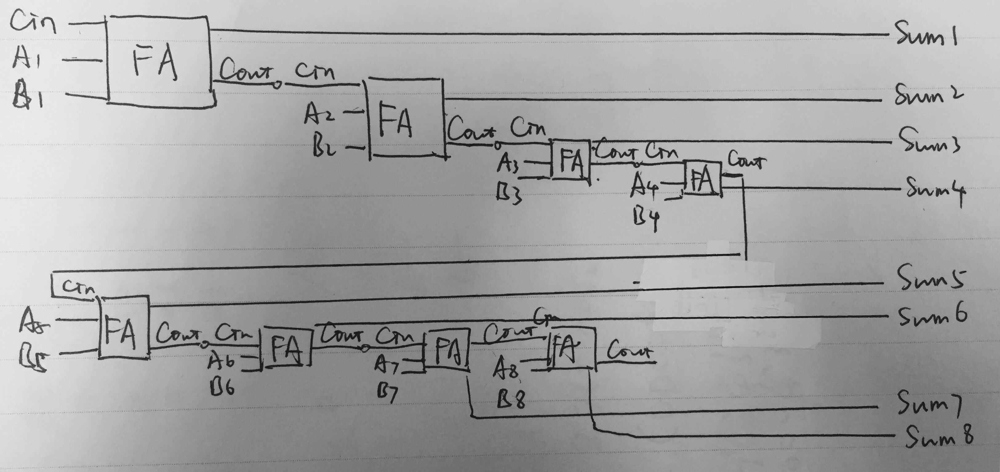

# **我的第五次作业**

>1) Give the three representations of an AND gate and say in your words what AND means.  

### **1. AND gate** 

#### Boolean Expression  
X = A · B  
#### Logic Diagram Symbol   
  

#### Truth Table  

|input|	|output|
|:-:|:-:|:-:|
|**A**| **B**| **A AND B**|
|0| 0| 0|
|0| 1| 0|
|1| 0| 0|
|1| 1| 1|

>2) Give the three representations of an XOR gate and say in your words what XOR means. 

### **2. XOR gate**

#### Boolean Expression  
X = A ⊕ B  
#### Logic Diagram Symbol  
  
#### Truth Table  
|A|	B| A XOR B|
:-:|:-:|:-:
0|	0|	0
0|	1|	1
1|	0|	1
1|	1|	0 

>3) Draw a circuit diagram corresponding to the following Boolean
expression: (A + B)(B + C)

### **3.** 

>4) Show the behavior of the following circuit with a truth table:  
>

### **4. Truth Table**

input|	|output|
:-:|:-:|:-:|
**A**| **B**| **X**
0| 0| 0
0| 1| 1
1| 0| 0
1| 1| 1
>5) What is circuit equivalence? Use truth table to prove the following formula.  
(AB)’ = A’ + B’

### **5.**
真值表相同的两个电路是等价的  
证明：   
#### Truth Table  

input|	|output| |
:-:|:-:|:-:|:-:
**A**| **B**| **(AB)’**| **A’ + B’**
0| 0| 1| 1
0| 1| 1| 1
1| 0| 1| 1
1| 1| 0| 0

综上所述，原题中两个真值表等价。

>6) There are eight 1bit full adder integrated circuits. Combine them to 8bit adder circuit using the following box diagram.

### **6.**

[Digital Adder](https://en.wikibooks.org/wiki/Digital_Electronics/Digital_Adder)

>7) Logical binary operations can be used to modify bit pattern. Such as   
(X8X7X6X5X4X3X2X1
)2 and (00001111)2 = (0000X4X3X2X1
)2  
We called that (00001111)2 is a mask which only makes low 4 bits to work.
Fill the follow expression

### **7.**
(1) (X8X7X6X5X4X3X2X1)2 or (00001111)2 = ( X8X7X6X51111)2  
(2) (X8X7X6X5X4X3X2X1)2 xor (00001111)2 = ( X8X7X6X5X4'X3'X2'X1')2  
(3) ((X8X7X6X5X4X3X2X1)2 and (11110000)2 )or (not (X8X7X6X5X4X3X2X1)2and (00001111)2) = ( X8X7X6X5X4'X3'X2'X1')2  

>8. 使用维基百科，解释以下概念。  
1)Logic gate  
2)Boolean algebra  

### **8. source: Wiki**
* **Logic gate**  
In electronics, a logic gate is an idealized or physical device implementing a Boolean function; that is, it performs a logical operation on one or more binary inputs and produces a single binary output.  
在电子学中，逻辑门是完成布尔函数的理想化或实体装置，它用来对一个或多个二进制输入执行一个逻辑运算操作并产生单个二进制输出。

* **Boolean algebra**    
In mathematics and mathematical logic, Boolean algebra is the branch of algebra in which the values of the variables are the truth values true and false, usually denoted 1 and 0 respectively.
在数学和数学逻辑中，布尔代数是代数的一个分支，它的变量值只有真和假，通常分别用 1 和 0 来表示。

>9. 自学存储电路。维基百科：“Flip-flop”，选择中文：
1)Flip-flop 中文翻译是？
2)How many bits information does a SR latch store?

### **9.**
1)中国大陆译作“触发器”、台湾及香港译作“正反器”  
2)A single latch can hold 1-bit of data.